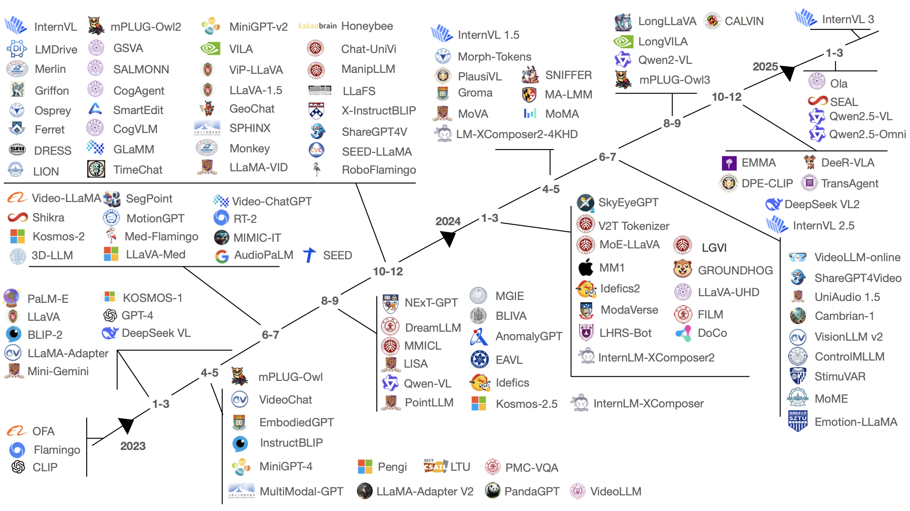

# Towards LLM-Centric Multimodal Fusion : A Survey on Integration Strategies and Techniques

 

This repository contains a curated list of papers related to the survey "Towards LLM-Centric Multimodal Fusion : A Survey on Integration Strategies and Techniques". The table below provides details for each paper, including links to the paper, tags based on their architecture, and citation information.

| Paper Title | Year | Tags | Citation |
|:--- |:--- |:--- |:--- |
| [SEAL: Speech Embedding Alignment Learning for Speech Large Language Model with Retrieval-Augmented Generation](https://arxiv.org/abs/2502.02603) | 2025 |     |  |
| [What Matters When Building Vision-Language Models?](https://arxiv.org/abs/2405.02246) | 2024 |     |  |
| [LLaVA-UHD: An LMM Perceiving Any Aspect Ratio and High-Resolution Images](https://arxiv.org/abs/2403.11703) | 2024 |    |  |
| [DeeR-VLA: Dynamic Inference of Multimodal Large Language Models for Efficient Robot Execution](https://arxiv.org/abs/2411.02359) | 2024 |    |  |
| [MM1: Methods, Analysis & Insights from Multimodal LLM Pre-training](https://arxiv.org/abs/2403.09611) | 2024 |    |  |
| [Improved Baselines with Visual Instruction Tuning](https://doi.org/10.1109/CVPR52733.2024.02484) | 2024 |    |  |
| [CogVLM: Visual Expert for Pretrained Language Models](https://arxiv.org/abs/2311.03079) | 2024 |     |  |
| [CogAgent: A Visual Language Model for GUI Agents](https://doi.org/10.1109/CVPR52733.2024.01354) | 2024 |     |  |
| [mPLUG-OwI2: Revolutionizing Multi-modal Large Language Model with Modality Collaboration](https://doi.org/10.1109/CVPR52733.2024.01239) | 2024 |     |  |
| [mPLUG-Owl3: Towards Long Image-Sequence Understanding in Multi-Modal Large Language Models](https://arxiv.org/abs/2408.04840) | 2024 |     |  |
| [LLaMA-VID: An Image Is Worth 2 Tokens in Large Language Models](https://doi.org/10.1007/978-3-031-72952-2_19) | 2024 |     |  |
| [SALMONN: Towards Generic Hearing Abilities for Large Language Models](https://arxiv.org/abs/2310.13289) | 2024 |    |  |
| [LMDrive: Closed-Loop End-to-End Driving with Large Language Models](https://doi.org/10.1109/CVPR52733.2024.01432) | 2024 |     |  |
| [CALVIN: Improved Contextual Video Captioning via Instruction Tuning](https://arxiv.org/abs/2312.09229) | 2024 |     |  |
| [Merlin:Empowering Multimodal LLMs with Foresight Minds](https://arxiv.org/abs/2312.00589) | 2024 |    |  |
| [VILA: On Pre-training for Visual Language Models](https://doi.org/10.1109/CVPR52733.2024.02520) | 2024 |    |  |
| [MoE-LLaVA: Mixture of Experts for Large Vision-Language Models](https://arxiv.org/abs/2401.15947) | 2024 |     |  |
| [ManipLLM: Embodied Multimodal Large Language Model for Object-Centric Robotic Manipulation](https://doi.org/10.1109/CVPR52733.2024.01710) | 2024 |     |  |
| [LongVILA: Scaling Long-Context Visual Language Models for Long Videos](https://arxiv.org/abs/2408.10188) | 2024 |    |  |
| [PMC-VQA: Visual Instruction Tuning for Medical Visual Question Answering](https://arxiv.org/abs/2305.10415) | 2024 |    |  |
| [X-InstructBLIP: A Framework for Aligning X-Modal Instruction-Aware Representations to LLMs and Emergent Cross-modal Reasoning](https://arxiv.org/abs/2311.18799) | 2024 |    |  |
| [VisionLLM v2: An End-to-End Generalist Multimodal Large Language Model for Hundreds of Vision-Language Tasks](https://arxiv.org/abs/2406.08394) | 2024 |    |  |
| [MiniGPT-4: Enhancing Vision-Language Understanding with Advanced Large Language Models](https://arxiv.org/abs/2304.10592) | 2024 |    |  |
| [TimeChat: A Time-sensitive Multimodal Large Language Model for Long Video Understanding](https://doi.org/10.1109/CVPR52733.2024.01357) | 2024 |     |  |
| [MA-LMM: Memory-Augmented Large Multimodal Model for Long-Term Video Understanding](https://doi.org/10.1109/CVPR52733.2024.01282) | 2024 |    |  |
| [LION : Empowering Multimodal Large Language Model with Dual-Level Visual Knowledge](https://doi.org/10.1109/CVPR52733.2024.02506) | 2024 |     |  |
| [Sniffer: Multimodal Large Language Model for Explainable Out-of-Context Misinformation Detection](https://doi.org/10.1109/CVPR52733.2024.01240) | 2024 |    |  |
| [Can't Make an Omelette without Breaking Some Eggs: Plausible Action Anticipation Using Large Video-Language Models](https://doi.org/10.1109/CVPR52733.2024.01758) | 2024 |     |  |
| [VideoLLM-online: Online Video Large Language Model for Streaming Video](https://doi.org/10.1109/CVPR52733.2024.01742) | 2024 |    |  |
| [Beyond Text: Frozen Large Language Models in Visual Signal Comprehension](https://doi.org/10.1109/CVPR52733.2024.02554) | 2024 |    |  |
| [LHRS-Bot: Empowering Remote Sensing with VGI-Enhanced Large Multimodal Language Model](https://doi.org/10.1007/978-3-031-72904-1_26) | 2024 |    |  |
| [AnomalyGPT: Detecting Industrial Anomalies Using Large Vision-Language Models](https://doi.org/10.1609/AAAI.V38I3.27963) | 2024 |     |  |
| [Cambrian-1: A Fully Open, Vision-Centric Exploration of Multimodal LLMs](https://arxiv.org/abs/2406.16860) | 2024 |    |  |
| [EmbodiedGPT: Vision-Language Pre-Training via Embodied Chain of Thought](https://arxiv.org/abs/2305.15021) | 2023 |     |  |
| [Language Is Not All You Need: Aligning Perception with Language Models](https://arxiv.org/abs/2302.14045) | 2023 |     |  |
| [Vision-Language Foundation Models as Effective Robot Imitators](https://arxiv.org/abs/2311.01378) | 2023 |     |  |
| [BLIP-2: Bootstrapping Language-Image Pre-training with Frozen Image Encoders and Large Language Models](https://arxiv.org/abs/2301.12597) | 2023 |     |  |
| [InstructBLIP: Towards General-purpose Vision-Language Models with Instruction Tuning](https://arxiv.org/abs/2305.06500) | 2023 |     |  |
| [Video-LLaMA: An Instruction-tuned Audio-Visual Language Model for Video Understanding](https://doi.org/10.18653/V1/2023.EMNLP-DEMO.49) | 2023 |     |  |
| [LLaMA-Adapter V2: Parameter-Efficient Visual Instruction Model](https://arxiv.org/abs/2304.15010) | 2023 |     |  |
| [VideoChat: Chat-Centric Video Understanding](https://arxiv.org/abs/2305.06355) | 2023 |     |  |
| [LLaVA-Med: Training a Large Language-and-Vision Assistant for Biomedicine in One Day](https://arxiv.org/abs/2306.00890) | 2023 |    |  |
| [PandaGPT: One Model To Instruction-Follow Them All](https://arxiv.org/abs/2305.16355) | 2023 |    |  |
| [Planting a SEED of Vision in Large Language Model](https://arxiv.org/abs/2307.08041) | 2023 |     |  |
| [VisionLLM: Large Language Model Is Also an Open-Ended Decoder for Vision-Centric Tasks](https://arxiv.org/abs/2305.11175) | 2023 |    |  |
| [RSGPT: A Remote Sensing Vision Language Model and Benchmark](https://arxiv.org/abs/2307.15266) | 2023 |    |  |
| [MultiModal-GPT: A Vision and Language Model for Dialogue with Humans](https://arxiv.org/abs/2305.04790) | 2023 |     |  |
| [Med-Flamingo: A Multimodal Medical Few-shot Learner](https://arxiv.org/abs/2307.15189) | 2023 |     |  |
| [Flamingo: A Visual Language Model for Few-Shot Learning](https://arxiv.org/abs/2204.14198) | 2022 |     |  |
</tbody>
</table>